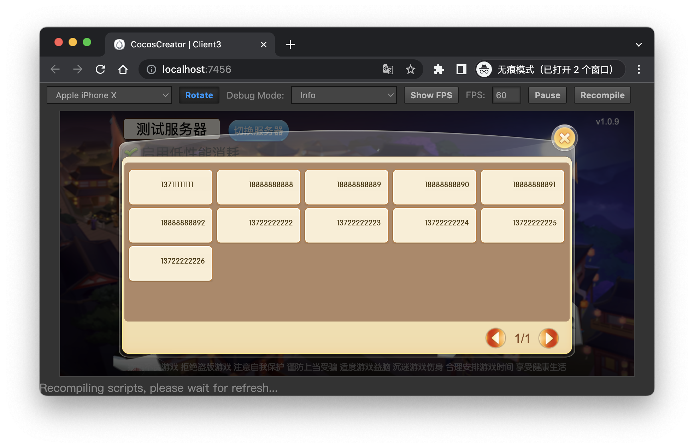

## 棋牌游戏客户端源码

### 1. 项目介绍

> 本项目乃阉割版,不分游戏玩法未公开,详情请看 [.gitignore](/.gitignore)
> 相关信息请查看主仓库下的介绍文档

### 2. 预览





### 3. 项目结构

```conf
.
├── README.md                   // 项目说明
├── assets                      // 资源目录
│   ├── MainScene.fire          // 主场景
│   ├── MainScene.fire.meta
│   ├── Script                  // 脚本目录
│   │   ├── API                 // API目录
│   │   ├── API.meta
│   │   ├── Base
│   │   ├── Base.meta
│   │   ├── Chat
│   │   ├── Chat.meta
│   │   ├── Constant            // 服务端设置
│   │   ├── Constant.meta
│   │   ├── Game                // 游戏逻辑
│   │   ├── Game.meta
│   │   ├── Lib                 // 通用库
│   │   ├── Lib.meta
│   │   ├── Models              // 数据模型
│   │   ├── Models.meta
│   │   ├── UI                  // UI逻辑
│   │   ├── UI.meta
│   │   ├── Utils
│   │   ├── Utils.meta
│   │   ├── Widget
│   │   └── Widget.meta
│   ├── Script.meta
│   ├── migration
│   │   ├── use_v2.0.x_cc.Toggle_event.js
│   │   └── use_v2.0.x_cc.Toggle_event.js.meta
│   ├── migration.meta
│   ├── project.manifest
│   ├── project.manifest.meta
│   ├── resources               // 资源目录
│   │   ├── Chat
│   │   ├── Chat.meta
│   │   ├── Common
│   │   ├── Common.meta
│   │   ├── Game
│   │   ├── Game.meta
│   │   ├── UI                  // UI资源
│   │   ├── UI.meta
│   │   ├── Widget
│   │   ├── Widget.meta
│   │   ├── tbl
│   │   └── tbl.meta
│   ├── resources.meta
│   ├── version.manifest
│   └── version.manifest.meta
├── creator.d.ts
├── jsconfig.json
├── packages                    // 项目插件
│   ├── bitmapfont              // 字体插件
│   │   ├── bitmap.js
│   │   ├── main.js
│   │   ├── package.json
│   │   └── panel
│   └── hot-update-tools        // 热更新插件
│       ├── core
│       ├── i18n
│       ├── mail
│       ├── main.js
│       ├── main_code.js
│       ├── node_modules
│       ├── package.json
│       └── panel
├── project.json
└── settings
    ├── builder.json
    ├── project.json
    └── services.json

30 directories, 40 files
```

### 4. 项目运行

- Cocos 2.4.8
- Node 16 LTS
- Npm 9.x.x
